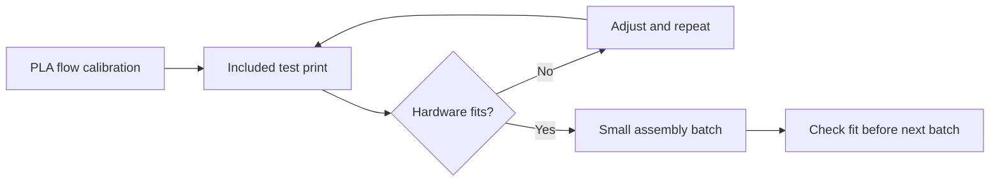

# Arctos printing guide — P1S + Bambu Lab PLA

Start with the included test piece. Print the arm in small batches after hardware fits correctly.

**Arctos standard settings**

From the official [Arctos print settings](https://arctosrobotics.com/docs/#print-settings), checked 2026-09-25:

| Setting | Published baseline |
| --- | --- |
| Material | PLA; PETG may need adjustments |
| Nozzle temperature | 215 °C; adjust for the filament brand |
| Nozzle / extrusion width | 0.4 / 0.4 mm |
| Layer height | 0.20 mm |
| Infill | 35% |
| Wall count | 4 |
| Top / bottom layers | 4 / 4 |
| Supports | Required on parts with unsupported features; inspect each part |

| Local v2.9.7 resource | Additional detail |
| --- | --- |
| [Package instructions](../cad/2.9.7/3MF/readme.txt) | Minimum 4 walls / 35% infill; supports from the build plate where needed |
| Bundled `2.9.7.3mf` | X1 Carbon / ASA, 0.42 mm default line width, 5 top / 3 bottom layers, Grid infill |

Use the published PLA baseline for a fresh setup. The bundled project's differing values are saved settings, not the published PLA standard. Arctos's table does not specify bed temperature, speed, fan settings, or infill pattern; the P1S starting choices below are separate recommendations.

| Your setup | Selection |
| --- | --- |
| Printer | Bambu Lab P1S, stock 0.4 mm stainless nozzle |
| Filament | Bambu Lab PLA; match the preset to the spool label (e.g., Bambu PLA Basic or Bambu PLA Matte) |
| Plate | Assumed stock Textured PEI; confirm the plate label |
| Build volume | 256 × 256 × 256 mm nominal; keep Bambu Studio's default exclusions |

Hardware reference: [Bambu P1S specifications](https://au.store.bambulab.com/products/p1s). No hardware upgrades needed for plain PLA.

**Prepare the project**

| Step | Action |
| --- | --- |
| 1 | Open `cad/2.9.7/3MF/2.9.7.3mf` as a project in Bambu Studio. |
| 2 | **Replace its X1 Carbon / ASA selections with P1S 0.4 mm / the matching Bambu PLA preset.** Reassign every object to that filament; check object overrides and discard old slicing results. |
| 3 | Keep the supplied orientations and plate order. Avoid automatic reorientation. |
| 4 | Apply the settings below, then slice again. Inspect supports, first layers, and plate boundaries. |
| 5 | Save your working 3MF and sliced files under `cad/prints/`. Export locally to microSD for printing; keep CAD, 3MF, and toolpaths out of Git and cloud uploads. |

The package provides prepared orientations and assembly-oriented plate order. Check settings again after changing the printer or filament preset; the P1S choices below have not been physically validated.

**P1S starting settings**

| Setting | Starting value |
| --- | --- |
| Process | Compatible 0.20 mm Standard preset |
| Layer height / first layer | 0.20 / 0.20 mm |
| Default extrusion width | 0.40 mm published baseline; inspect any per-feature width overrides |
| Wall loops | 4 minimum |
| Infill | 35% minimum; Gyroid suggested (supplied profile uses Grid) |
| Top / bottom layers | 4 / 4, matching the published baseline |
| Nozzle temperature | Arctos baseline: 215 °C; adjust to the matching Bambu PLA preset and spool guidance |
| Textured PEI bed | 55 °C starting point; Bambu lists 45–60 °C for PLA |
| Cooling / flow limit | Matching Bambu PLA preset defaults |
| Speed | Standard mode; avoid Sport/Ludicrous while establishing fit |
| Scale | 100%; preserve dimensions |
| Supports | Where needed, build plate only; inspect each plate for unsupported regions |
| Brim | Preserve supplied intent; start with 5 mm on parts needing extra adhesion |

For PLA on Textured PEI, Bambu recommends removing the top glass and requires no glue. Wash the plate with detergent and water, avoid touching its surface, and let prints cool before removal. [Bambu plate guidance](https://eu.store.bambulab.com/en-ch/products/bambu-textured-pei-plate).

**Print order and acceptance**

| Stage | What to print / check |
| --- | --- |
| Calibration | Use Bambu Studio's manual flow calibration for your spool; save the result. Bed leveling does not calibrate filament flow. |
| Fit test | Print `Test print all_1-Test print all-stl.stl` from `cad/2.9.7/2.9.7/`; use the project's orientation if present. Check with the actual bearings, nuts, and bolts before large parts. |
| Main batches | Follow the supplied plate sequence. Confirm quantities against the assembly instructions; filenames alone do not establish quantities. |
| Gears, pulleys, cycloidal disks | Print separately as the package directs. Remove strings and check mating parts turn without binding before motor operation. |
| Brim group | Package instructions identify plate 29; check adhesion and brim clearance. |
| Covers | Choose open-loop or closed-loop covers to match your electronics; closed-loop alternatives are outside the supplied plates. |

Flow calibration and test fits are also recommended by the [Arctos FAQ](https://arctosrobotics.com/1121-2/).

**Fix before continuing**

| Symptom | Next action |
| --- | --- |
| Bearings or nuts will not seat | Remove brim/support residue; check flow and first-layer flare. Reprint the test before changing hole compensation. Do not scale the entire arm to fix holes. |
| Warped base or lifting corner | Clean the plate, verify its preset, add a brim; reduce auxiliary fan if lifting occurs on that side. |
| Stringing on teeth | Print parts separately; dry PLA per its manufacturer's instructions if needed. |
| Missing teeth, gaps, weak layers | Reject the part; check extrusion and slow the affected features before reprinting. |
| Warm mounts deform or joints loosen | Stop and reassess material suitability before loaded operation. PLA printing success does not establish payload or duty cycle. |

PLA has limited heat resistance: Bambu lists about 57 °C heat deflection for PLA Basic; this is a laboratory property, **not a safe operating temperature** for the arm. [Bambu material comparison](https://us.store.bambulab.com/collections/bambu-lab-3d-printer-filament/products/pps-cf).

Record plate ID, filament grams, print time, and fit result locally under `cad/prints/`. Obtain material and time totals from your final slices; no full-build estimate has been verified.

Sources checked 2026-09-25: [Arctos documentation](https://arctosrobotics.com/docs/#print-settings) and local v2.9.7 package instructions/profile. The published baseline and P1S recommendations are distinguished above; no physical print validation of these recommendations has been performed.
