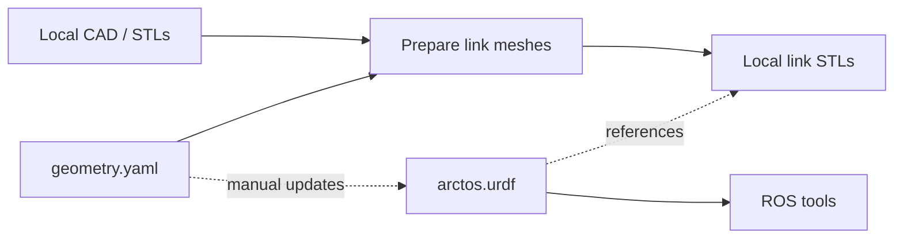

# Arctos project overview

Status: 2026-09-25. We have a working ROS 2 workspace and an initial CAD-based robot description.
The current model describes the arm's structure; hardware control is not implemented.

**What we built and why**

| Step | What we have | Purpose |
| --- | --- | --- |
| 1. Set up the workspace | ROS 2 Jazzy on Ubuntu 24.04; packages in `src/`; [colcon defaults](../colcon_defaults.yaml) | Give the project a repeatable build environment and keep generated files separate from source. |
| 2. Create the ROS package | [arctos_description](../src/arctos_description/README.md), with `package.xml` and `CMakeLists.txt` | Declare dependencies and install the model, configuration, and mesh preparation command where ROS can find them. |
| 3. Analyze the CAD | Local STL measurements checked against STEP cylinder axes | Locate joints from actual shaft and bearing geometry. |
| 4. Record the geometry | [geometry.yaml](../src/arctos_description/config/geometry.yaml) | Assign parts to seven rigid links and record six joint axes, frame origins, and alignment corrections. |
| 5. Prepare link meshes | [prepare_meshes.py](../src/arctos_description/scripts/prepare_meshes.py) and local STL exports | Combine each link's parts and translate their vertices from assembly coordinates into that link's frame. |
| 6. Define the robot | [arctos.urdf](../src/arctos_description/urdf/arctos.urdf) | Connect the links with joints, reference their meshes, and convert millimetres to metres. |
| 7. Build and validate | Colcon build, URDF parsing, and mesh coordinate checks | Check that ROS can discover the package and that the explicit model preserves the intended structure and geometry. |

**How the model is produced**

A **link** is a rigid part or group of parts; a **joint** connects two links.
A **frame** defines where a link's coordinates begin and which way its axes point.
**URDF** explicitly defines every link and joint; this model needs no Xacro expansion.

**Supporting setup work**

| Resource | Purpose | Current status |
| --- | --- | --- |
| [Project guidance](../AGENTS.md) | Define source references, commenting style, scope, and CAD privacy rules. | Local CAD analysis is authorized; purchased assets and mesh exports remain excluded from Git. |
| [Printing guide](PRINTING_GUIDE.md) | Document preparation and fit checks for the P1S and owned PLA. | Instructions prepared; physical print validation is not recorded. |
| [BOM](BOM.csv) and [budget summary](BOM_SUMMARY.md) | Organize components, purchase links, and planning allowances. | Prices and compatibility still need verification. |
| [MVP BOM](MVP_BOM.csv) and [axis BOM](AXIS_BOM.csv) | Plan staged purchasing and show reuse and per-axis allocations. | Planning documents; they do not establish hardware readiness. |

**What the current model does not establish**

| Area | Remaining work |
| --- | --- |
| Assembly fit | Review link grouping and the wrist body's +3 mm alignment correction against the assembly. |
| Joint motion | Confirm travel, speed, and effort limits; all six modeled joints currently have zero limits. |
| Calibration | Establish hardware home positions and motor directions; the current zero pose is the CAD assembly pose. |
| Model completeness | Motors, fasteners, covers, and the gripper are not represented. |
| Simulation and control | Collision shapes, inertial properties, transmissions, hardware drivers, and motion planning are not implemented. |

Build and model-generation commands are in the [workspace README](../README.md)
and [description package instructions](../src/arctos_description/README.md).
Passing software checks does not verify physical assembly or robot motion.
