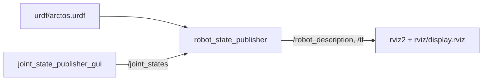

# Arctos description

Initial structural URDF from purchased v2.9.7 STLs, checked against STEP cylinder axes.
Mesh assets and generated exports stay local under Git-ignored `cad/`.

| Model property | Status |
| --- | --- |
| Geometry | Seven links using actual structural STLs; motors, fasteners, covers, and gripper omitted |
| Joint axes | Six axes located from bearing/shaft geometry; positive directions follow the right-hand rule |
| Tool frames | `flange` (X out) and `tool0` (Z out) on the C-core outer face, per ROS-Industrial |
| Zero pose | Supplied CAD assembly pose; hardware home and motor signs uncalibrated |
| Joint limits | Computed by `joint_limits.py` from structural CAD; effort and velocity are 0 (unverified) |
| Collision | Seven reduced local meshes; detailed visuals retained; no inertial model |
| Wrist fit | `B-core.stl` shifted +3 mm in X to align its bore with the carrier bores; assembly fit needs review |

Prepare local meshes, then build the package:

```bash
cd ~/arctos_ws
source /opt/ros/jazzy/setup.bash
# Generate visuals first, then collision meshes; all assets stay under cad/.
python3 src/arctos_description/scripts/prepare_meshes.py \
  --cad-root "$PWD/cad/2.9.7" \
  --geometry "$PWD/src/arctos_description/config/geometry.yaml"
python3 src/arctos_description/scripts/prepare_collision_meshes.py --cad-root cad/2.9.7
colcon build --packages-select arctos_description
source install/local_setup.bash
check_urdf src/arctos_description/urdf/arctos.urdf
```

`config/geometry.yaml` records source filenames, assembly-frame origins in mm, axes,
and mesh alignment corrections. Re-run mesh preparation after changing geometry.
Update the explicit URDF origins and axes to match any geometry changes.
Joint offsets are (child origin − parent origin) / 1000, in metres.

`urdf/arctos.urdf` can be loaded directly without Xacro. Its mesh paths use
`package://arctos_description/meshes/`, which the build installs from `cad/2.9.7/urdf_meshes/`.
All link frames initially share the STL assembly orientation: Z up, X toward the tool.

| Joint | Axis | Source feature |
| --- | --- | --- |
| 1 | Z | X pulley shaft cylinders |
| 2 | Y | Y core and Z lower core bearing bores |
| 3 | Y | Z upper core and Z gearbox shaft bores |
| 4 | X | A inner/outer core cylinders |
| 5 | Y | BL/BR carrier and bevel gear bores |
| 6 | X | C core cylinders |

## Collision geometry

Collision meshes are generated from the detailed link STLs with VTK decimation.
They retain the same origins and millimetre scale. `flange` and `tool0` are frames only.

| Check | Result |
| --- | --- |
| Triangle count | About 256,000 → 98,530 (61% fewer) |
| Surface difference | ≤ 0.46 mm measured at vertices and triangle centres, in both directions |
| Open boundaries and connected components | Counts preserved |
| Detailed visual meshes | Unchanged |
| Local outputs | `cad/2.9.7/collision_meshes/`, including a JSON measurement report |

After regenerating visual meshes, regenerate collision meshes before rebuilding:

```bash
python3 src/arctos_description/scripts/prepare_collision_meshes.py --cad-root cad/2.9.7
colcon build --packages-select arctos_description
```

The generator requires `python3-vtk9` and rejects sampled deviations above 0.5 mm.
Validation against the detailed model: all 1,101 sampled collision decisions agreed.
A seeded home-to-`across_blocks` RRTConnect benchmark took 19.02 s with detailed
meshes and 16.73 s with reduced meshes; all 494 sampled path states were valid in
both models. This is one comparison, not a general timing guarantee.

Decimation is an approximation, not a guaranteed enclosing shape; sampled checks
are not a continuous collision proof. Motors, fasteners, covers, cables, and the
gripper remain omitted. The existing joint limits still use the detailed visual
meshes. RViz sliders do not enforce collisions.

## Joint limits

The limit rule lives in `scripts/joint_limits.py`:

| Rule | Value |
| --- | --- |
| Limit | Nearest collision angle ÷ 1.5 (`FACTOR_OF_SAFETY`) |
| Collisions | Self-collision, or contact with the table (`base_link` bottom plane) |
| Downstream joints | Worst case over their limits, sampled ≤ 45° apart |
| No collision within 360° | ±180° |

```bash
# Sweep each joint over the local link meshes and print its limits (about 20 min).
ros2 run arctos_description joint_limits.py \
  --urdf src/arctos_description/urdf/arctos.urdf --mesh-dir cad/2.9.7/urdf_meshes
```

| Joint | Collision angle (cause) | Limit |
| --- | --- | --- |
| 1 | none | ±180° |
| 2 | −80.2° upper arm × shoulder; +75.9° tool × base | −53.5° / +50.6° |
| 3 | −203.7° elbow × upper arm; +69.0° wrist roll × upper arm | −135.8° / +46.0° |
| 4, 5, 6 | none | ±180° |

Only structural parts are checked. Motors, cables, and the gripper are not modelled and may stop a joint sooner.

## View in RViz

```bash
# Load ROS and the built workspace.
source /opt/ros/jazzy/setup.bash && source ~/arctos_ws/install/local_setup.bash
# Start the model, joint state publisher, and RViz.
ros2 launch arctos_description display.launch.py
```


```mermaid
flowchart LR
  URDF[urdf/arctos.urdf] --> RSP[robot_state_publisher]
  JSP[joint_state_publisher_gui] -- /joint_states --> RSP
  RSP -- /robot_description, /tf --> RVIZ[rviz2 + rviz/display.rviz]
```

| Launch argument | Default | Use |
| --- | --- | --- |
| `model` | installed `urdf/arctos.urdf` | URDF file to display |
| `rviz_config` | installed `rviz/display.rviz` | RViz layout: grid, robot model, TF |
| `gui` | `true` | Joint sliders; `false` publishes zero joint states |

Sliders appear only for joints with a non-zero limit range.

Reference: [Arctos docs](https://arctosrobotics.com/docs/) and
[BOM](https://arctosrobotics.com/bom/). Geometry comes from local CAD; the BOM does
not establish joint limits. Verify travel and assembly fit before enabling motion.
